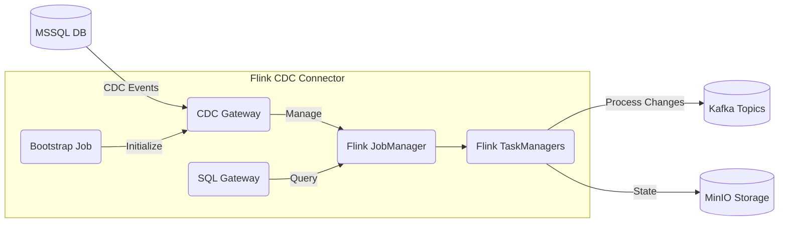

# Apache Flink CDC Connector for OpenShift

<div align="center">


**Real-time data synchronization from MSSQL to Kafka in air-gapped environments**

[](https://flink.apache.org/)
[](https://helm.sh/)
[](https://www.redhat.com/en/technologies/cloud-computing/openshift)

</div>

## 🚀 Quick Start

### Prerequisites
- Kubernetes or OpenShift cluster
- Internal Docker Registry (air-gapped environment)
- Helm 3.x installed
- MSSQL Server with CDC enabled
- Kafka Cluster
- MinIO/S3 Compatible Storage

### Installation
```bash
# Clone the repository
git clone https://github.com/mosiko1234/flink-cdc-chart.git
cd flink-cdc-chart

# Configure your settings in values.yaml
# Then install the chart
helm install flink-cdc ./flink-cdc-connector -n flink-cdc --create-namespace
```

### Access and Verification
```bash
# Get the Flink JobManager route (OpenShift)
oc get route flink-cdc-jobmanager -n flink-cdc

# Check CDC Gateway health
curl http://flink-cdc-cdcgateway:8084/health

# View running pipelines
curl http://flink-cdc-cdcgateway:8084/api/v1/pipelines
```

---

## 📋 What's Inside

This Helm chart deploys a production-ready CDC solution that captures changes from MSSQL databases and streams them to Kafka topics in real-time. It's specifically designed for **air-gapped OpenShift environments** where security and reliability are paramount.

<table>
<tr>
<th>Component</th>
<th>Purpose</th>
<th>Scalability</th>
</tr>
<tr>
<td>Flink JobManager</td>
<td>Orchestrates CDC jobs and provides web UI</td>
<td>Supports HA mode (2+ replicas)</td>
</tr>
<tr>
<td>Flink TaskManagers</td>
<td>Execute CDC processing workloads</td>
<td>Horizontally scalable (2+ replicas)</td>
</tr>
<tr>
<td>SQL Gateway</td>
<td>Accepts SQL queries for dynamic data access</td>
<td>Optional component</td>
</tr>
<tr>
<td>CDC Gateway</td>
<td>Simplifies CDC pipeline management</td>
<td>Recommended for production</td>
</tr>
<tr>
<td>Bootstrap Job</td>
<td>Auto-initializes CDC pipelines</td>
<td>One-time job at startup</td>
</tr>
</table>

---

## 🏛️ Architecture



### Data Flow
1. **Capture**: MSSQL transaction logs are monitored for changes (inserts, updates, deletes)
2. **Process**: Flink CDC processes these changes through configured pipelines
3. **Publish**: Changes are formatted and published to designated Kafka topics
4. **Store**: Checkpoints and savepoints stored in MinIO/S3 for resilience

---

## ⚙️ Configuration Guide

### Essential `values.yaml` Settings

#### Global Settings
```yaml
global:
  imageRegistry: "registry.example.com"  # Your air-gapped registry
  namespace: "flink-cdc"
  imagePullSecrets: []  # Add secrets if needed for pulling images
  storageClass: ""  # Specify default storage class for PVCs
```

#### Image Configuration
```yaml
# Main Flink image settings
image:
  repository: registry.example.com/flink
  tag: 1.17.1
  pullPolicy: IfNotPresent

# CDC Gateway image settings
cdcGateway:
  enabled: true
  image:
    repository: registry.example.com/flink-cdc
    tag: "0.7.0"
    pullPolicy: IfNotPresent

# Bootstrap job image settings  
bootstrap:
  enabled: true
  image:
    repository: registry.example.com/curl
    tag: latest
    pullPolicy: IfNotPresent
```

#### Component Resource Configurations
```yaml
# JobManager resources
jobmanager:
  resources:
    limits:
      cpu: 2
      memory: 2Gi
    requests:
      cpu: 1
      memory: 1Gi

# TaskManager resources
taskmanager:
  resources:
    limits:
      cpu: 4
      memory: 4Gi
    requests:
      cpu: 2
      memory: 2Gi
      
# CDC Gateway resources
cdcGateway:
  resources:
    limits:
      cpu: 1
      memory: 1Gi
    requests:
      cpu: 0.5
      memory: 512Mi
```

#### External Services
```yaml
externalServices:
  # MSSQL connection 
  mssql:
    host: "mssql.example.com"
    port: 1433
    database: "your_database"
    credentialsSecret: "mssql-credentials"
    options:
      applicationName: "flink-cdc"
      trustServerCertificate: true
    cdcTables:
      - schema: "dbo"
        table: "table1"
      - schema: "dbo"
        table: "table2"
      - schema: "sales"
        table: "orders"

  # Kafka connection
  kafka:
    brokers: "kafka-broker-1.example.com:9092,kafka-broker-2.example.com:9092"
    credentialsSecret: "kafka-credentials"
    # Kafka topic configuration (optional)
    defaultTopicConfig:
      partitions: 3
      replicationFactor: 3
      retention: "7d"
    
  # MinIO/S3 connection
  minio:
    endpoint: "http://minio.example.com:9000"
    credentialsSecret: "minio-credentials"
    checkpointBucket: "flink-checkpoints"
    savepointBucket: "flink-savepoints"
    pathStyleAccess: true
```

#### CDC Pipeline Configuration
```yaml
pipelines:
  - name: "orders-to-kafka"
    enabled: true
    source:
      type: "sqlserver-cdc"
      table: "sales.orders"
      options:
        scan.startup.mode: "initial"
    sink:
      type: "kafka"
      topic: "cdc.orders"
      options:
        format: "json"
```

---

## 🛠️ Advanced Usage

### Adding New CDC Pipelines Dynamically

Create a pipeline definition file:

```json
{
  "pipelines": [
    {
      "name": "new-table-to-kafka",
      "source": {
        "type": "sqlserver-cdc",
        "config": {
          "hostname": "mssql.example.com",
          "port": 1433,
          "username": "${MSSQL_USERNAME}",
          "password": "${MSSQL_PASSWORD}",
          "database-name": "your_database",
          "table-name": "dbo.new_table",
          "scan.startup.mode": "initial"
        }
      },
      "sink": {
        "type": "kafka",
        "config": {
          "bootstrapServers": "kafka-broker-1.example.com:9092",
          "topic": "cdc.new_table",
          "format": "json"
        }
      }
    }
  ]
}
```

Submit the pipeline:

```bash
curl -X POST http://flink-cdc-cdcgateway:8084/api/v1/pipelines/import \
     -H "Content-Type: application/json" \
     -d @pipeline-definition.json
```

### Scaling for Production

For production workloads, consider these scaling options:

```yaml
# High Availability for JobManager
jobmanager:
  replicas: 2
  highAvailability:
    enabled: true

# Increase TaskManager capacity
taskmanager:
  replicas: 4
  resources:
    limits:
      cpu: 8
      memory: 16Gi
    requests:
      cpu: 4
      memory: 8Gi
  slots: 4

# Larger persistent storage
persistence:
  enabled: true
  size: 100Gi
```

---

## 🔒 Security Features

- **Air-gapped deployment**: No external internet connectivity required
- **Secure credential management**: All sensitive information stored in Kubernetes Secrets
- **OpenShift compatibility**: Adheres to OpenShift's restricted-v2 Security Context Constraints
- **Service isolation**: Components are properly isolated with appropriate service accounts
- **TLS support**: Compatible with TLS-secured Kafka and MSSQL connections

### Creating Required Secrets

Before deploying, create these secrets:

```bash
# MSSQL credentials
oc create secret generic mssql-credentials \
  --from-literal=username=your_mssql_user \
  --from-literal=password=your_mssql_password \
  -n flink-cdc

# Kafka credentials (if using SASL)
oc create secret generic kafka-credentials \
  --from-literal=username=your_kafka_user \
  --from-literal=password=your_kafka_password \
  -n flink-cdc

# MinIO/S3 credentials
oc create secret generic minio-credentials \
  --from-literal=accessKey=your_minio_access_key \
  --from-literal=secretKey=your_minio_secret_key \
  -n flink-cdc
```

---

## 📊 Monitoring & Observability

### Prometheus & Grafana Integration

The chart includes optional ServiceMonitor and Prometheus Rule support:

```yaml
monitoring:
  enabled: true
  serviceMonitor:
    enabled: true  # For Prometheus Operator
  prometheusRule:
    enabled: true  # For alerting
  dashboards:
    enabled: true  # For Grafana
```

### OpenShift Monitoring Integration

To integrate with OpenShift's built-in monitoring stack:

```bash
# Create a ServiceMonitor in the flink-cdc namespace
oc apply -f - <<EOF
apiVersion: monitoring.coreos.com/v1
kind: ServiceMonitor
metadata:
  name: flink-cdc-monitor
  namespace: flink-cdc
  labels:
    k8s-app: flink-cdc-monitor
spec:
  endpoints:
  - interval: 30s
    port: metrics
    scheme: http
    path: /metrics
  selector:
    matchLabels:
      app.kubernetes.io/name: flink-cdc-connector
  namespaceSelector:
    matchNames:
      - flink-cdc
EOF

# Enable user workload monitoring in OpenShift
oc apply -f - <<EOF
apiVersion: v1
kind: ConfigMap
metadata:
  name: cluster-monitoring-config
  namespace: openshift-monitoring
data:
  config.yaml: |
    enableUserWorkload: true
EOF
```

### Key Metrics to Monitor

- **Flink JobManager**
  - `flink_jobmanager_job_uptime` - Job uptime
  - `flink_jobmanager_job_numRestarts` - Number of job restarts (critical alert threshold: > 5)
  - `flink_jobmanager_running_jobs` - Number of running jobs (warning if < expected number)

- **Flink TaskManager**
  - `flink_taskmanager_Status_JVM_Memory_Heap_Used` - Heap memory usage
  - `flink_taskmanager_Status_JVM_CPU_Load` - CPU load (warning threshold: > 80%)
  - `flink_taskmanager_job_task_numRestarts` - Task restart count

- **CDC Specific**
  - `flink_taskmanager_job_task_operator_numRecordsIn` - Records processed (monitor for sudden drops)
  - `flink_taskmanager_job_task_operator_numRecordsOut` - Records output to Kafka
  - `flink_taskmanager_job_task_operator_cdc_sourceLatency` - CDC source latency (critical if > 60s)

- **Checkpointing**
  - `flink_jobmanager_job_lastCheckpointDuration` - Duration of last checkpoint (warning if > 30s)
  - `flink_jobmanager_job_lastCheckpointSize` - Size of last checkpoint
  - `flink_jobmanager_job_lastCheckpointFailureTimestamp` - Timestamp of last checkpoint failure

### Grafana Dashboard Template

You can import a pre-configured Grafana dashboard for CDC monitoring. Create a ConfigMap with:

```yaml
apiVersion: v1
kind: ConfigMap
metadata:
  name: flink-cdc-grafana-dashboard
  namespace: flink-cdc
  labels:
    grafana_dashboard: "true"
data:
  flink-cdc-dashboard.json: |
    {
      "annotations": {
        "list": [...]
      },
      "editable": true,
      "gnetId": null,
      "graphTooltip": 0,
      "id": 1,
      "links": [],
      "panels": [
        {
          "alert": {
            "conditions": [
              {
                "evaluator": {
                  "params": [5],
                  "type": "gt"
                },
                "operator": {
                  "type": "and"
                },
                "query": {
                  "params": ["A", "5m", "now"]
                },
                "reducer": {
                  "params": [],
                  "type": "avg"
                },
                "type": "query"
              }
            ],
            "executionErrorState": "alerting",
            "frequency": "60s",
            "handler": 1,
            "name": "Job Restarts alert",
            "noDataState": "no_data",
            "notifications": []
          },
          "aliasColors": {},
          "bars": false,
          "dashLength": 10,
          "dashes": false,
          "datasource": "Prometheus",
          "fill": 1,
          "gridPos": {
            "h": 8,
            "w": 12,
            "x": 0,
            "y": 0
          },
          "id": 2,
          "legend": {
            "avg": false,
            "current": false,
            "max": false,
            "min": false,
            "show": true,
            "total": false,
            "values": false
          },
          "lines": true,
          "linewidth": 1,
          "nullPointMode": "null",
          "percentage": false,
          "pointradius": 2,
          "points": false,
          "renderer": "flot",
          "seriesOverrides": [],
          "spaceLength": 10,
          "stack": false,
          "steppedLine": false,
          "targets": [
            {
              "expr": "flink_jobmanager_job_numRestarts",
              "refId": "A"
            }
          ],
          "thresholds": [
            {
              "colorMode": "critical",
              "fill": true,
              "line": true,
              "op": "gt",
              "value": 5
            }
          ],
          "timeFrom": null,
          "timeRegions": [],
          "timeShift": null,
          "title": "Job Restarts",
          "tooltip": {
            "shared": true,
            "sort": 0,
            "value_type": "individual"
          },
          "type": "graph",
          "xaxis": {
            "buckets": null,
            "mode": "time",
            "name": null,
            "show": true,
            "values": []
          },
          "yaxes": [
            {
              "format": "short",
              "label": null,
              "logBase": 1,
              "max": null,
              "min": null,
              "show": true
            },
            {
              "format": "short",
              "label": null,
              "logBase": 1,
              "max": null,
              "min": null,
              "show": true
            }
          ],
          "yaxis": {
            "align": false,
            "alignLevel": null
          }
        }
      ],
      "refresh": "10s",
      "schemaVersion": 18,
      "style": "dark",
      "tags": [],
      "templating": {
        "list": []
      },
      "time": {
        "from": "now-6h",
        "to": "now"
      },
      "timepicker": {
        "refresh_intervals": [
          "5s",
          "10s",
          "30s",
          "1m",
          "5m",
          "15m",
          "30m",
          "1h",
          "2h",
          "1d"
        ],
        "time_options": [
          "5m",
          "15m",
          "1h",
          "6h",
          "12h",
          "24h",
          "2d",
          "7d",
          "30d"
        ]
      },
      "timezone": "",
      "title": "Flink CDC Monitoring",
      "version": 1
    }
```

---

## 🌟 Best Practices

### Resource Management
- **Resource Planning**: Size your TaskManagers appropriately for your workload
- **State Management**: Use external checkpoints in MinIO/S3 for disaster recovery
- **Pipeline Design**: Separate critical and non-critical tables into different pipelines
- **Monitoring**: Implement alerts for pipeline failures and lag metrics
- **Backups**: Regularly backup the MinIO/S3 buckets containing state
- **Upgrading**: Use savepoints when upgrading Flink or configuration changes

### Image Management in Air-Gapped Environments

Working in an air-gapped OpenShift environment requires special attention to image management:

```bash
# Step 1: Download required images to a connected environment
docker pull flink:1.17.1
docker pull debezium/debezium-connector-sqlserver:1.9
docker pull curlimages/curl:latest

# Step 2: Tag images for your private registry
docker tag flink:1.17.1 registry.example.com/flink:1.17.1
docker tag debezium/debezium-connector-sqlserver:1.9 registry.example.com/flink-cdc:0.7.0
docker tag curlimages/curl:latest registry.example.com/curl:latest

# Step 3: Push to your private registry
docker push registry.example.com/flink:1.17.1
docker push registry.example.com/flink-cdc:0.7.0
docker push registry.example.com/curl:latest

# Step 4: Configure OpenShift to use these images
oc create secret docker-registry registry-credentials \
  --docker-server=registry.example.com \
  --docker-username=your_registry_user \
  --docker-password=your_registry_password \
  -n flink-cdc

# Step 5: Link the pull secret to your service account
oc secrets link default registry-credentials --for=pull -n flink-cdc
```

#### Image Registry Considerations

1. **Registry Performance**: Your internal registry should have sufficient resources for concurrent pulls
2. **Image Versions**: Document exact image versions used in production
3. **Scheduled Updates**: Create a process for regular image updates with security fixes
4. **Version Compatibility**: Ensure Flink version compatibility with CDC connectors
5. **Image Scanning**: Implement security scanning in your internal registry

#### Custom Image Recommendations:

For best results in production, consider building these custom images:

1. **Base Flink image with CDC connectors pre-installed**:
   ```Dockerfile
   FROM flink:1.17.1
   
   # Add Debezium SQL Server connector
   RUN mkdir -p /opt/flink/plugins/cdc/lib
   COPY debezium-connector-sqlserver-1.9.7.Final.jar /opt/flink/plugins/cdc/lib/
   COPY debezium-core-1.9.7.Final.jar /opt/flink/plugins/cdc/lib/
   COPY flink-connector-kafka_2.12-1.17.1.jar /opt/flink/plugins/cdc/lib/
   
   # Add any custom configurations
   COPY custom-flink-conf.yaml /opt/flink/conf/flink-conf.yaml
   ```

2. **CDC Gateway image**:
   ```Dockerfile
   FROM registry.example.com/flink:1.17.1
   
   # Add CDC Gateway application
   COPY cdc-gateway.jar /opt/flink/lib/
   
   # Default entrypoint for CDC Gateway
   ENTRYPOINT ["/opt/flink/bin/flink", "run", "/opt/flink/lib/cdc-gateway.jar"]
   ```

---

## 🔍 Troubleshooting

### Common Issues

| Problem | Possible Cause | Solution |
|---------|----------------|----------|
| Pipeline not starting | MSSQL CDC not enabled | Enable CDC on database and tables |
| Connection failures | Network or credential issues | Verify secrets and network connectivity |
| Task failures | Resource limits too low | Increase memory/CPU limits |
| Low throughput | Insufficient parallelism | Increase TaskManager slots and pipeline parallelism |
| Checkpoint failures | MinIO connectivity issues | Check MinIO connection and credentials |

### Logs to Check

```bash
# JobManager logs
oc logs -f deploy/flink-cdc-jobmanager -n flink-cdc

# TaskManager logs 
oc logs -f deploy/flink-cdc-taskmanager -n flink-cdc

# CDC Gateway logs
oc logs -f deploy/flink-cdc-cdcgateway -n flink-cdc
```

---

## 📘 References

- [Apache Flink Documentation](https://nightlies.apache.org/flink/flink-docs-release-1.17/)
- [Debezium & SQL Server CDC](https://debezium.io/documentation/reference/stable/connectors/sqlserver.html)
- [Kafka Documentation](https://kafka.apache.org/documentation/)
- [MinIO Documentation](https://min.io/docs/minio/container/index.html)
- [Helm Documentation](https://helm.sh/docs/)

---

## 🤝 Support & Contributions

For issues, feature requests, or contributions, please:

1. Open an issue in our [GitHub repository](https://github.com/mosiko1234/flink-cdc-chart/issues)
2. For commercial support, contact us at mosiko1234@gmail.com

---

<div align="center">
  
### Made with ❤️ for the OpenShift Community

</div>