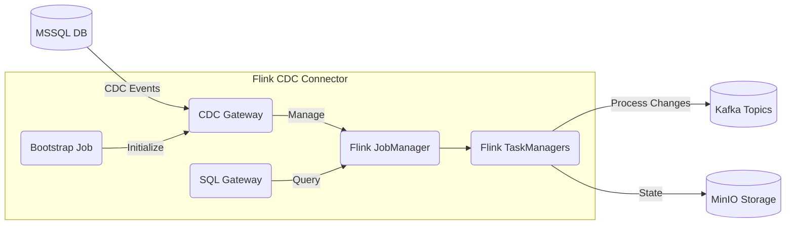

# Apache Flink CDC Connector for OpenShift

<div align="center">


**Real-time data synchronization from MSSQL to Kafka in air-gapped environments**

[](https://flink.apache.org/)
[](https://helm.sh/)
[](https://www.redhat.com/en/technologies/cloud-computing/openshift)

</div>

## 🚀 Quick Start

### Prerequisites
- Kubernetes or OpenShift cluster
- Internal Docker Registry (air-gapped environment)
- Helm 3.x installed
- MSSQL Server with CDC enabled
- Kafka Cluster
- MinIO/S3 Compatible Storage

### Installation
```bash
# Clone the repository
git clone https://github.com/yourusername/flink-cdc-chart.git
cd flink-cdc-chart

# Configure your settings in values.yaml
# Then install the chart
helm install flink-cdc ./flink-cdc-connector -n flink-cdc --create-namespace
```

### Access and Verification
```bash
# Get the Flink JobManager route (OpenShift)
oc get route flink-cdc-jobmanager -n flink-cdc

# Check CDC Gateway health
curl http://flink-cdc-cdcgateway:8084/health

# View running pipelines
curl http://flink-cdc-cdcgateway:8084/api/v1/pipelines
```

---

## 📋 What's Inside

This Helm chart deploys a production-ready CDC solution that captures changes from MSSQL databases and streams them to Kafka topics in real-time. It's specifically designed for **air-gapped OpenShift environments** where security and reliability are paramount.

<table>
<tr>
<th>Component</th>
<th>Purpose</th>
<th>Scalability</th>
</tr>
<tr>
<td>Flink JobManager</td>
<td>Orchestrates CDC jobs and provides web UI</td>
<td>Supports HA mode (2+ replicas)</td>
</tr>
<tr>
<td>Flink TaskManagers</td>
<td>Execute CDC processing workloads</td>
<td>Horizontally scalable (2+ replicas)</td>
</tr>
<tr>
<td>SQL Gateway</td>
<td>Accepts SQL queries for dynamic data access</td>
<td>Optional component</td>
</tr>
<tr>
<td>CDC Gateway</td>
<td>Simplifies CDC pipeline management</td>
<td>Recommended for production</td>
</tr>
<tr>
<td>Bootstrap Job</td>
<td>Auto-initializes CDC pipelines</td>
<td>One-time job at startup</td>
</tr>
</table>

---

## 🏛️ Architecture



### Data Flow
1. **Capture**: MSSQL transaction logs are monitored for changes (inserts, updates, deletes)
2. **Process**: Flink CDC processes these changes through configured pipelines
3. **Publish**: Changes are formatted and published to designated Kafka topics
4. **Store**: Checkpoints and savepoints stored in MinIO/S3 for resilience

---

## ⚙️ Configuration Guide

### Essential `values.yaml` Settings

#### Global Settings
```yaml
global:
  imageRegistry: "registry.example.com"  # Your air-gapped registry
  namespace: "flink-cdc"
```

#### External Services
```yaml
externalServices:
  # MSSQL connection 
  mssql:
    host: "mssql.example.com"
    port: 1433
    database: "your_database"
    credentialsSecret: "mssql-credentials"
    cdcTables:
      - schema: "dbo"
        table: "table1"

  # Kafka connection
  kafka:
    brokers: "kafka-broker-1.example.com:9092,kafka-broker-2.example.com:9092"
    credentialsSecret: "kafka-credentials"
    
  # MinIO/S3 connection
  minio:
    endpoint: "http://minio.example.com:9000"
    credentialsSecret: "minio-credentials"
    checkpointBucket: "flink-checkpoints"
    savepointBucket: "flink-savepoints"
```

#### CDC Pipeline Configuration
```yaml
pipelines:
  - name: "orders-to-kafka"
    enabled: true
    source:
      type: "sqlserver-cdc"
      table: "sales.orders"
      options:
        scan.startup.mode: "initial"
    sink:
      type: "kafka"
      topic: "cdc.orders"
      options:
        format: "json"
```

---

## 🛠️ Advanced Usage

### Adding New CDC Pipelines Dynamically

Create a pipeline definition file:

```json
{
  "pipelines": [
    {
      "name": "new-table-to-kafka",
      "source": {
        "type": "sqlserver-cdc",
        "config": {
          "hostname": "mssql.example.com",
          "port": 1433,
          "username": "${MSSQL_USERNAME}",
          "password": "${MSSQL_PASSWORD}",
          "database-name": "your_database",
          "table-name": "dbo.new_table",
          "scan.startup.mode": "initial"
        }
      },
      "sink": {
        "type": "kafka",
        "config": {
          "bootstrapServers": "kafka-broker-1.example.com:9092",
          "topic": "cdc.new_table",
          "format": "json"
        }
      }
    }
  ]
}
```

Submit the pipeline:

```bash
curl -X POST http://flink-cdc-cdcgateway:8084/api/v1/pipelines/import \
     -H "Content-Type: application/json" \
     -d @pipeline-definition.json
```

### Scaling for Production

For production workloads, consider these scaling options:

```yaml
# High Availability for JobManager
jobmanager:
  replicas: 2
  highAvailability:
    enabled: true

# Increase TaskManager capacity
taskmanager:
  replicas: 4
  resources:
    limits:
      cpu: 8
      memory: 16Gi
    requests:
      cpu: 4
      memory: 8Gi
  slots: 4

# Larger persistent storage
persistence:
  enabled: true
  size: 100Gi
```

---

## 🔒 Security Features

- **Air-gapped deployment**: No external internet connectivity required
- **Secure credential management**: All sensitive information stored in Kubernetes Secrets
- **OpenShift compatibility**: Adheres to OpenShift's restricted-v2 Security Context Constraints
- **Service isolation**: Components are properly isolated with appropriate service accounts
- **TLS support**: Compatible with TLS-secured Kafka and MSSQL connections

### Creating Required Secrets

Before deploying, create these secrets:

```bash
# MSSQL credentials
oc create secret generic mssql-credentials \
  --from-literal=username=your_mssql_user \
  --from-literal=password=your_mssql_password \
  -n flink-cdc

# Kafka credentials (if using SASL)
oc create secret generic kafka-credentials \
  --from-literal=username=your_kafka_user \
  --from-literal=password=your_kafka_password \
  -n flink-cdc

# MinIO/S3 credentials
oc create secret generic minio-credentials \
  --from-literal=accessKey=your_minio_access_key \
  --from-literal=secretKey=your_minio_secret_key \
  -n flink-cdc
```

---

## 📊 Monitoring & Observability

### Prometheus & Grafana Integration

The chart includes optional ServiceMonitor and Prometheus Rule support:

```yaml
monitoring:
  enabled: true
  serviceMonitor:
    enabled: true  # For Prometheus Operator
  prometheusRule:
    enabled: true  # For alerting
  dashboards:
    enabled: true  # For Grafana
```

### Key Metrics to Monitor

- Flink JobManager health (REST API & UI)
- TaskManager slots utilization
- CDC pipeline lag (time between source change and Kafka message)
- Checkpoint completion rate and duration
- JVM garbage collection metrics

---

## 🌟 Best Practices

- **Resource Planning**: Size your TaskManagers appropriately for your workload
- **State Management**: Use external checkpoints in MinIO/S3 for disaster recovery
- **Pipeline Design**: Separate critical and non-critical tables into different pipelines
- **Monitoring**: Implement alerts for pipeline failures and lag metrics
- **Backups**: Regularly backup the MinIO/S3 buckets containing state
- **Upgrading**: Use savepoints when upgrading Flink or configuration changes

---

## 🔍 Troubleshooting

### Common Issues

| Problem | Possible Cause | Solution |
|---------|----------------|----------|
| Pipeline not starting | MSSQL CDC not enabled | Enable CDC on database and tables |
| Connection failures | Network or credential issues | Verify secrets and network connectivity |
| Task failures | Resource limits too low | Increase memory/CPU limits |
| Low throughput | Insufficient parallelism | Increase TaskManager slots and pipeline parallelism |
| Checkpoint failures | MinIO connectivity issues | Check MinIO connection and credentials |

### Logs to Check

```bash
# JobManager logs
oc logs -f deploy/flink-cdc-jobmanager -n flink-cdc

# TaskManager logs 
oc logs -f deploy/flink-cdc-taskmanager -n flink-cdc

# CDC Gateway logs
oc logs -f deploy/flink-cdc-cdcgateway -n flink-cdc
```

---

## 📘 References

- [Apache Flink Documentation](https://nightlies.apache.org/flink/flink-docs-release-1.17/)
- [Debezium & SQL Server CDC](https://debezium.io/documentation/reference/stable/connectors/sqlserver.html)
- [Kafka Documentation](https://kafka.apache.org/documentation/)
- [MinIO Documentation](https://min.io/docs/minio/container/index.html)
- [Helm Documentation](https://helm.sh/docs/)

---

## 🤝 Support & Contributions

For issues, feature requests, or contributions, please:

1. Open an issue in our [GitHub repository](https://github.com/yourusername/flink-cdc-chart/issues)
2. For commercial support, contact us at admin@example.com

---

<div align="center">
  
### Made with ❤️ for the OpenShift Community

</div>